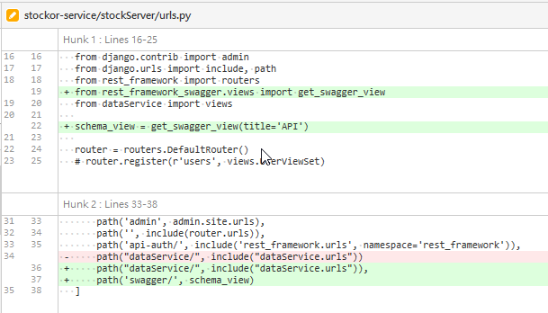

[[_TOC_]]
- [開發經驗](#開發經驗)
  - [資料庫操作類( `DB`)](#資料庫操作類-db)
    - [1. django如何刪除Table並重新初始化:](#1-django如何刪除table並重新初始化)
  - [API類( `API`)](#api類-api)
    - [1.  Django REST framework swagger整合](#1--django-rest-framework-swagger整合)
    - [2. django-rest-swagger產生頁面錯誤(swagger_templateSyntaxError)](#2-django-rest-swagger產生頁面錯誤swagger_templatesyntaxerror)
  - [Model操作](#model操作)


# 開發經驗
## 資料庫操作類( `DB`)

### 1. django如何刪除Table並重新初始化:

- 步驟:
    - 刪除db中對應的表 (mysql)

        

    - 刪除db中django_migrations對應的app_id    
        
        

    - 删除表所在项目migrations目录下除init.py外的所有python文件
        
        

    - 重新執行指令:
    ```
        python manage.py makemigrations
        python manage.py migrate
    ```
        
- Ref : [django删除表后重新建表](https://blog.csdn.net/u011996193/article/details/105811769?spm=1001.2101.3001.6650.4&utm_medium=distribute.pc_relevant.none-task-blog-2%7Edefault%7ECTRLIST%7Edefault-4-105811769-blog-102973565.pc_relevant_default&depth_1-utm_source=distribute.pc_relevant.none-task-blog-2%7Edefault%7ECTRLIST%7Edefault-4-105811769-blog-102973565.pc_relevant_default&utm_relevant_index=7)

- ###### tags: `DB` `Model` `Django` `makemigrations`

## API類( `API`)

### 1.  Django REST framework swagger整合
- 步驟:
    - Installation
      ```$ pip install django-rest-swagger```
    - Add 'rest_framework_swagger' to INSTALLED_APPS in Django settings.
      - file : settings.py
      ```py
          INSTALLED_APPS = [
              ...
              'rest_framework_swagger',
              ...
          ]
      ```
    - 更新url
        - file : urls.py
          - note: 官網文件的```django.conf.urls```需改成```django.urls```，並使用path
            ```py
                from django.urls import path
                from rest_framework_swagger.views import get_swagger_view

                schema_view = get_swagger_view(title='Pastebin API')

                urlpatterns = [
                    path(r'^$', schema_view)
                ]
            ```
            
- Ref : [Django REST Swagger
](https://django-rest-swagger.readthedocs.io/en/latest/)
- ###### tags: `API` `Swagger` `Django`

### 2. django-rest-swagger產生頁面錯誤(swagger_templateSyntaxError)
- 錯誤訊息:
    

- 原因 : 版本問題(django)
- 解決方式
    - 找到 django-rest-swagger 這套件的位置
        ```
            使用pip show django-rest-swagger找位置
            ...site-packages\rest_framework_swagger\templates\rest_framework_swagger
        ```
    - 更改index.html內容
    - 檔案位置:
        site-packages\rest_framework_swagger\templates\rest_framework_swagger\index.html
    - 修改參數
         ```
             before : 
             after  : 
         ```
         

    - 重新refash頁面
        

- Ref : [django3.2使用django-rest-swagger生成文档报错‘staticfiles‘ is not a registered tag library](https://blog.csdn.net/qq_39248122/article/details/117563521)
- ###### tags: `API` `Swagger` `Django`


## Model操作


