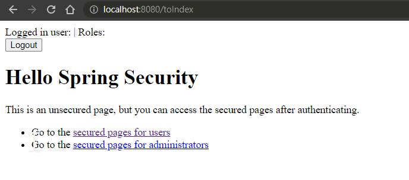

# 開發紀錄

- [開發紀錄](#開發紀錄)
  - [Spring boot thymeleaf](#spring-boot-thymeleaf)
    - [實作](#實作)
  - [Spring Security](#spring-security)
    - [WebSecurityConfigurerAdapter棄用問題](#websecurityconfigureradapter棄用問題)
  - [參考資料](#參考資料)

## Spring boot thymeleaf

### 實作

  

1. ```pom.xml```加入dependency

  ```xml
  <dependency>
      <groupId>org.springframework.boot</groupId>
      <artifactId>spring-boot-starter-security</artifactId>
  </dependency>
  ```

2. ```application.yml```設定config.

  ```yml
    thymeleaf:
      suffix: .html
      # prefix: classpath:/templates/
      servlet:
        content-type: text/html
      encoding: UTF-8
      cache: false
  ```

3. 新增html頁面.

- path: src/main/resources/templates
- 建立html file

  ```html
  <!DOCTYPE html>
  <html lang="en" xmlns:th="http://www.thymeleaf.org" xmlns:sec="http://www.w3.org/1999/xhtml">
  <head>
      <meta charset="UTF-8">
      <title>Hello Spring Security</title>
  </head>
  <body>
  <div th:fragment="logout" class="logout" sec:authorize="isAuthenticated()">
      Logged in user: <span sec:authentication="name"></span> |
      Roles: <span sec:authentication="principal.authorities"></span>
      <div>
          <form action="#" th:action="@{/logout}" method="post">
              <input type="submit" value="Logout"/>
          </form>
      </div>
  </div>
  <h1>Hello Spring Security</h1>
  <p>This is an unsecured page, but you can access the secured pages after authenticating.</p>
  </body>
  </html>
  ```

4. 新增ViewController - MyMvcConfig

  - 使用```addViewControllers```原因為為了**實現無業務邏輯**的導轉

    ```java
    import org.springframework.context.annotation.Configuration;
    import org.springframework.web.servlet.config.annotation.ViewControllerRegistry;
    import org.springframework.web.servlet.config.annotation.WebMvcConfigurer;
    /**
    * MvcConfig-mvc配置.
    *
    * @author jayyeh
    * @version 1.0.0
    * @date 2023/01/20
    * @see WebMvcConfigurer
    */
    @Configuration
    public class MvcConfig implements WebMvcConfigurer {
        // 配置view controller入口即對應的file
        public void addViewControllers(ViewControllerRegistry registry) {
            registry.addViewController("/").setViewName("index");
            registry.addViewController("/toHome").setViewName("home");
            registry.addViewController("/toLogin").setViewName("login");
        }
    }
    ```

  - 也可以使用Controller處理
  
    ```java
    @Controller
    public class HomeController {
        @GetMapping("/toIndex")
        public ModelAndView root() {
            ModelAndView modelAndView = new ModelAndView();
            modelAndView.addObject("msg", "Hello!!!");
            modelAndView.setViewName("index");
            return modelAndView;
        }
        @RequestMapping("/toLtoIndexogin")
        public String index() {
            return "login";
        }
      }
    ```

## Spring Security

### WebSecurityConfigurerAdapter棄用問題

- Spring官方

> below we follow best practice by using the Spring Security lambda DSL and the method HttpSecurity#authorizeHttpRequests to define our authorization rules

- 原因:
  - 因Spring Security5.7開始棄用```WebSecurityConfigurerAdapter棄用問題```, Spring官方鼓勵使用```component-based```的安全配置
  - 棄用WebSecurityConfigurerAdapter步驟
    - 刪除WebSecurityConfigurerAdapter
    - 刪除WebSecurityConfigurerAdapter的所有override
    - 使用SecurityFilterChain並配置HttpSecurity,使用WebSecurityCustomizer配置WebSecurity

- 解法:
  - 原先使用方式: WebSecurityConfigurerAdapter
  
  ```java
    @Configuration
    @EnableWebSecurity
    public class SecurityConfiguration extends WebSecurityConfigurerAdapter {
        @Override
        protected void configure(HttpSecurity http) throws Exception {
            // configure HTTP security...
        }
        @Override
        public void configure(WebSecurity web) throws Exception {
            // configure Web security...
        }      
    }
  ```

  - 棄用後寫法 : component-based
  
  ```java
    @Configuration
    public class SecurityConfiguration {
        @Bean
        public SecurityFilterChain filterChain(HttpSecurity http) throws Exception {
        }
        @Bean
        public WebSecurityCustomizer webSecurityCustomizer() {
        }
    }
  ```

## 參考資料

- Spring Security
  - WebSecurityConfigurerAdapter
    - [Spring Security without the WebSecurityConfigurerAdapter官方文件](https://spring.io/blog/2022/02/21/spring-security-without-the-websecurityconfigureradapter)
    - [Spring Security 替换WebSecurityConfigurerAdapter (Deprecated)的方法](https://blog.csdn.net/allway2/article/details/127781632)
- Other
