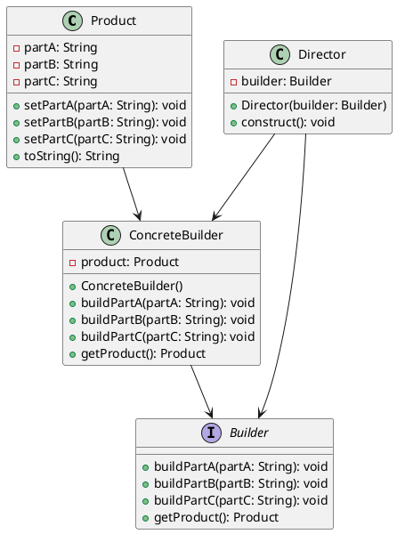
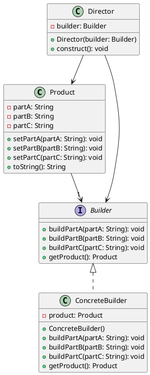

# 建造者模式（Builder）

- [建造者模式（Builder）](#建造者模式builder) - [Builder 實作](#builder-實作)

---

## 簡單介紹

> 建造者模式（Builder）是一種軟體設計模式，用於創建複雜的物件，將創建過程分為多個步驟，並允許您在不同步驟中創建不同的物件表示方式。 通常用於創建複雜的物件，例如擁有多個屬性和方法的物件，而不需要直接暴露其內部結構。 透過這種方式，可以簡化創建複雜物件的過程，並且可以改進程式碼的可維護性和可讀性。

---

## 定義

- 是一種創建者模式，主要用於創建複雜的物件，將物件的建立和表示分離，通過相同的建造過程創建不同的表示形式。
- 負責將一個複雜的物件進行分步建造，並且提供一個統一的介面供用戶端使用，將建造過程和具體實現進行分離，使得用戶端不需要知道內部實現的細節，只需要知道建造者的介面即可。

---

## 角色定義

- 產品（Product）：表示被建造的複雜物件，通常包含多個部件
- 抽象建造者（Builder）：定義了建造者的統一介面，包含建造各個部件的抽象方法
- 具體建造者（ConcreteBuilder）：實現抽象建造者介面，完成各個部件的具體建造
- 指揮者（Director）：負責調用建造者完成各個部件的建造，並組裝成最終的產品

---

## 架構




---

## 應用場景

- 經典案例
  - StringBuilder
    - StringBuilder 是一個經典的 Builder 模式實現，可以用來動態構建字符串。StringBuilder 提供了多種方法來添加、修改和刪除字符串中的內容，可以方便地實現字符串的構建。
  - AlertDialog.Builder
    - 在 Android 中，AlertDialog 是一個常見的對話框，AlertDialog.Builder 是它的 Builder 實現，可以用來動態構建對話框。AlertDialog.Builder 提供了多種方法來設置對話框的標題、消息、按鈕等屬性，可以方便地構建出一個完整的對話框。
  - OkHttpClient.Builder
    - 在 OkHttp 中，OkHttpClient 是一個常見的 HTTP 客戶端，OkHttpClient.Builder 是它的 Builder 實現，可以用來動態配置 OkHttpClient 的屬性。OkHttpClient.Builder 提供了多種方法來設置連接超時、讀取超時、緩存等屬性，可以方便地構建出一個符合需求的 OkHttpClient。
- 創建複雜對象：
  - 當創建一個對象需要許多步驟，而每個步驟又有不同的選項時，可以使用 Builder 模式來組織這些步驟和選項，使得代碼更加清晰易讀，也更容易擴展和維護。
- 創建多種不同的對象：
  - 當需要創建多種不同的對象時，可以使用 Builder 模式來定義一個通用的創建過程，然後在這個過程的基礎上定義不同的建造者來創建不同的對象。
- 創建不可變對象：
  - 當需要創建不可變的對象時，可以使用 Builder 模式來構建這些對象，因為在建造過程中，對象的狀態是可以控制的，最終創建出來的對象也是不可變的。
- 創建具有嚴格結構的對象：
  - 當需要創建具有嚴格結構的對象時，可以使用 Builder 模式來控制創建過程，確保對象的結構是正確的。

---

## 實作

在範例中，Product 是需要創建的複雜對象，而 ConcreteBuilder 是實際建造者，建造者擁有創建 Product 的具體方法，透過這些方法創建出 Product 物件。

- 目的

  - 是為了創建一個複雜的產品(Product)，並使其創建過程和表示分離。
    - Product:是需要創建的複雜對象
    - ConcreteBuilder:是實際建造者
      - 實現了 Builder，並提供了具體的建造方法和取得產品的方法。
    - Director:調用建造者的方法來創建 Product
      - 確保 Product 的建造過程是按照一定的順序和規則進行的
    - Builder
      - 定義了創建 Product 的接口，包括三個部分：
        - 定義 Product 的各個部分的建造方法(buildPartA、buildPartB、buildPartC)
        - 定義產品的建造方法
        - 取得最終建造出的產品的方法(getProduct)

- UML



- Code

```java
public class Product {
    private String partA;
    private String partB;
    private String partC;
    public void setPartA(String partA) {
        this.partA = partA;
    }
    public void setPartB(String partB) {
        this.partB = partB;
    }
    public void setPartC(String partC) {
        this.partC = partC;
    }
    @Override
    public String toString() {
        return "Product{" +
                "partA='" + partA + '\'' +
                ", partB='" + partB + '\'' +
                ", partC='" + partC + '\'' +
                '}';
    }
}

public interface Builder {
    void buildPartA(String partA);
    void buildPartB(String partB);
    void buildPartC(String partC);
    Product getProduct();
}

public class ConcreteBuilder implements Builder {
    private Product product;
    public ConcreteBuilder() {
        this.product = new Product();
    }
    @Override
    public void buildPartA(String partA) {
        product.setPartA(partA);
    }
    @Override
    public void buildPartB(String partB) {
        product.setPartB(partB);
    }
    @Override
    public void buildPartC(String partC) {
        product.setPartC(partC);
    }
    @Override
    public Product getProduct() {
        return product;
    }
}

public class Director {
    private Builder builder;
    public Director(Builder builder) {
        this.builder = builder;
    }
    public void construct() {
        builder.buildPartA("Part A");
        builder.buildPartB("Part B");
        builder.buildPartC("Part C");
    }
}

public class BuilderExample {
    public static void main(String[] args) {
        Builder builder = new ConcreteBuilder();
        Director director = new Director(builder);
        director.construct();
        Product product = builder.getProduct();
        System.out.println(product);
    }
}

```
