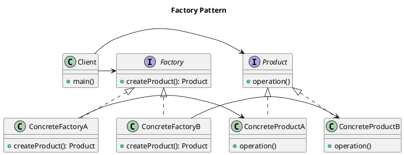

# Factory Pattern(工廠模式)

- [Factory Pattern(工廠模式)](#factory-pattern工廠模式)
  - [目的](#目的)
  - [日常案例](#日常案例)
  - [特性](#特性)
  - [應用時機](#應用時機)
  - [三種工廠模式](#三種工廠模式)
    - [Simple Factory Pattern](#simple-factory-pattern)
    - [Factory Method Pattern](#factory-method-pattern)
    - [Abstract Factory Pattern](#abstract-factory-pattern)
  - [Reference](#reference)

---




---

## 目的

- 提供一個工廠介面，將產生實體的程式碼交由子類別各自實現
- 定義一個用於建立物品的介面，讓子類決定實體化哪一個類別。工廠方法使一個類別的實例化延遲到其子類別。

## 日常案例

當我們在使用工廠模式時，
你跟工廠說你想要的那種規格的商品，
而工廠負責製造你想要的那種規格的商品，
當中可能需要某些組裝或是特殊步驟，
但是作為消費者你不知道這些組裝方式和步驟，
你還是可以買到你想要的東西。

## 特性

- 優點 :
  - 隱藏物件實例化之過程，若需要調整只需要調整工廠即可
  - 減輕建構子之負擔，使 class 更輕量
- 缺點 :
  - 需寫大量的 factory，會增加 code 的複雜度。
  - 增加 code 的相依性，影響 trace code 的效率。

## 應用時機

- 當你的 class constructor 很擁腫的時候
- 當你 create object 時需要用到很多「這個 class 不需要知道」的東西
- 當你不在乎 sub-class，只在乎 super-class 的時候（例如你只要一些 Animal，不在乎 Dog 或 Cat）
- 當你有很多 sub-classes，而它們的 create 方法大同小異的時候

## 三種工廠模式


| 工廠模式 | 簡單工廠模式                               | 工廠方法模式                                                             | 抽象工廠模式                                             |
| -------- | ------------------------------------------ | ------------------------------------------------------------------------ | -------------------------------------------------------- |
| 定義     | 由一個工廠對象創建所有的產品對象           | 由一個工廠類別決定創建哪一種產品類別的實例                               | 定義一個用於創建對象的介面，讓子類決定實例化哪一個類別   |
| 簡單說明 | 所有的產品都由一個工廠製造                 | 有多個工廠,但一個工廠只生產一個產品                                      | 有多個工廠,每個工廠可以生產多種產品                      |
| 優點     | 統一管理創建實例，降低耦合度               | 簡單易懂，創建對象無需額外代碼                                           | 較為靈活，新增產品時只需新增相應的工廠類別               |
| 缺點     | 產品過多時，程式碼過於複雜                 | 擴展性較差，新增產品需要修改工廠類別程式碼                               | 產品種類過多時，工廠程式碼複雜                           |
| 實作方法 | 統一工廠類別，搭配傳入參數決定創建對象類別 | 在工廠類別中實現創建對象的方法，由使用者傳入參數決定創建哪一種類別的對象 | 定義抽象的工廠類別，由具體的工廠類別來實現具體的產品創建 |

### Simple Factory Pattern

- 免到處製造新 Object（Object instantiation），
- 統一在工廠（Factory）生產。
- Client 只能透過工廠製作出想要的 object。
- UML

  

  ```plantuml
  @startuml
  interface Product {
      + operation()
  }

  class ConcreteProductA {
      + operation()
  }

  class ConcreteProductB {
      + operation()
  }

  class SimpleFactory {
      + createProduct(String productType) : Product
  }

  SimpleFactory -> Product : Creates >
  SimpleFactory -> ConcreteProductA : Uses >
  SimpleFactory -> ConcreteProductB : Uses >
  @enduml
  ```

### Factory Method Pattern

- 定義:
  - 屬於創建型模式，
  - 提供一個創建一系列相關或相互依賴的對象接口，無須指定他們具體類
- UML:

  

  ```plantuml
  @startuml

  abstract class Creator {
      +abstract createProduct(): Product
  }

  class ConcreteCreator1 {
      +createProduct(): Product
  }

  class ConcreteCreator2 {
      +createProduct(): Product
  }

  interface Product {
      +use(): void
  }

  class ConcreteProduct1 {
      +use(): void
  }

  class ConcreteProduct2 {
      +use(): void
  }

  Creator <|- ConcreteCreator1
  Creator <|- ConcreteCreator2
  Product <|.. ConcreteProduct1
  Product <|.. ConcreteProduct2
  Creator --> Product

  @enduml
  ```

- 組成:
  - 抽象工廠(AbstractFactory)：包含所以的產品建立的抽象方法
  - 具體工廠(ConcreteFactory)：具體工廠
  - 抽象產品(AbstractProduct)：都有多種不同的實現
  - 具體產品(Product)：為抽象產品的具體實現
- 優點
  - 抽象工廠模式可以實現高內聚低耦合的設計目的，因此抽象工廠模式被廣泛的應用。
  - 當一個產品族中的多個對象被設計成一起工作時，它能保證客戶端始終使用同一個產品族中的對象。
  - 增加新的具體工廠和產品族很方便，不需要修改已有的系統，符合“開閉原則”。
- 缺點
  - 在產品族中擴充功能新的產品是很困難的，它需要修改抽象工廠的介面。
  - 增加新的工廠和產品族容易，增加新的產品等級結構麻煩(開閉原則的傾斜性)。

### Abstract Factory Pattern


- UML

  

  ```plantuml
  @startuml
  skinparam class {
      BackgroundColor WhiteSmoke
      BorderColor Black
  }
  interface AbstractProductA {
      +methodA()
  }
  interface AbstractProductB {
      +methodB()
  }
  class ProductA1 {
      +methodA()
  }
  class ProductA2 {
      +methodA()
  }
  class ProductB1 {
      +methodB()
  }
  class ProductB2 {
      +methodB()
  }
  AbstractProductA <|.. ProductA1
  AbstractProductA <|.. ProductA2
  AbstractProductB <|.. ProductB1
  AbstractProductB <|.. ProductB2

  interface AbstractFactory {
      +createProductA(): AbstractProductA
      +createProductB(): AbstractProductB
  }
  class ConcreteFactory1 {
      +createProductA(): AbstractProductA
      +createProductB(): AbstractProductB
  }
  class ConcreteFactory2 {
      +createProductA(): AbstractProductA
      +createProductB(): AbstractProductB
  }
  AbstractFactory <|-- ConcreteFactory1
  AbstractFactory <|-- ConcreteFactory2
  ConcreteFactory1 --> ProductA1
  ConcreteFactory1 --> ProductB1
  ConcreteFactory2 --> ProductA2
  ConcreteFactory2 --> ProductB2
  @enduml
  ```

- 範例:

  - ConnectionFactory 建立連線

  ```java
  interface Connection {
      void open();
  }
  public class HTTPConnection implements Connection {
      URL url;
      public HTTPConnection(URL url) {
          this.url = url;
      }
      public void open() {
          // Open url with browser
      }
  }
  public class SSHConnection implements Connection {
      Server destinationServer;
      public SSHConnection(Server destinationServer) {
          this.destinationServer = destinationServer;
      }
      public void open() {
          // Open a terminal and ssh into the destination server
      }
  }

  public void main(){
      ConnectionFactory factory = new ConnectionFactory();
      Connection conn = factory.createConnection(link);
      conn.open();
  }
  ```

---

## Reference

- [Chapter 3 抽象工廠模式](https://rongli.gitbooks.io/design-pattern/content/chapter3.html)
- [工廠模式 Factory Pattern](https://skyyen999.gitbooks.io/-study-design-pattern-in-java/content/factory.html)
- [Factory Patterns - Factory Method Pattern](https://www.codeproject.com/Articles/1135918/Factory-Patterns-Factory-Method-Pattern)
