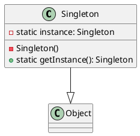

# Singleton Pattern (單例模式)

- [Singleton Pattern (單例模式)](#singleton-pattern-單例模式)
  - [定義](#定義)
  - [UML](#uml)
  - [特性:](#特性)
  - [應用情境:](#應用情境)
  - [兩種實作方式:](#兩種實作方式)
  - [實作篇](#實作篇)
    - [1. Eagerly singleton](#1-eagerly-singleton)
    - [2. Lazily singleton](#2-lazily-singleton)
    - [3. Enum singleton](#3-enum-singleton)
    - [4. Initialized singleton](#4-initialized-singleton)
    - [5. Double Checked Locking singleton](#5-double-checked-locking-singleton)

---

## 定義

- 只有一個實例，而且自行實例化並向整個系統提供這個實例
- 保證一個類別只會產生一個物件，而且要提供存取該物件的統一方法，也被稱為貪婪單例模式(Greed Singleton)，因為一開始就已經建立物件。

## UML




## 特性:

- 優點 :
  - 簡單、方便，提供唯一入口操作物件。無需經過繁複的初始化流程即可操作。可以避免多個實例引起的同步問題。
  - 確保資料正確性，例如使用者登入狀態等重要資訊只有一個唯一的實例，可以避免同步問題和資料不一致問題。
- 缺點 :
  - 應保持單純，不適合放置複雜邏輯。如果 Singleton 包含複雜邏輯，應該考慮使用 Facade pattern 進行封裝。
  - getInstance() 應避免過度使用，應該考慮使用 dependency injection 將需要的類別注入到將要使用的類別，以提高可測性。Singleton 不易進行單元測試。

## 應用情境:

- 當資源有限，只能有一個客戶端使用該資源時，例如多執行緒中的資源競爭。
- 當需要限制同一時間內只能有一個實例，例如 Windows 的 Task Manager。
- 當需要共享且唯一的實例，例如網站計數器。

## 兩種實作方式:

- 懶漢式

  - DEF
    - 懶漢式是指在第一次調用時才創建單例對象，如果之後再次調用時，仍然返回第一次創建的對象
  - 線程不安全的懶漢式
    - 單例對象在第一次調用時創建，但在多線程的情況下可能會出現多個實例，因此線程不安全。
  - 線程安全的懶漢式：
    - 將實例化的代碼包含在一個 synchronized 块中，保證多線程時只能創建一個實例。但是，這種方式會降低程序的性能。
  - 實作

  ```java
  public class LazySingleton {
      private static LazySingleton instance = null;

      private LazySingleton() {
          // 私有构造方法
      }

      public static LazySingleton getInstance() {
          if (instance == null) {
              instance = new LazySingleton();
          }
          return instance;
      }
  }
  ```

- 餓漢式

  - DEF
    - 餓漢式是指在類加載時就創建單例對象，不管後面有沒有使用該對象，都會一直存在。餓漢式有一個明顯的缺點：如果單例對象佔用的資源比較多，而一直不被使用，會導致系統資源的浪費。
  - 實作

  ```java
  public class EagerSingleton {
      private static EagerSingleton instance = new EagerSingleton();

      private EagerSingleton() {
          // 私有构造方法
      }

      public static EagerSingleton getInstance() {
          return instance;
      }
  }
  ```

- 應用情境:
  - 外部資源
    - 在我們撰寫多執行緒的時候，一定都會遇到當資源有限的情況下，只能有一個 Client 可以取得該資源時，同一時間我們該如何去判斷只有一位 Client 可以獲取資源。這就是獨體模式。
  - Windows 的 Task Manager（任務管理器）
    - 同一時間內我們無法打開兩個 windows task manager
  - 網站的計數器
- 問題 : 當多執行緒時，有機會產生多個物件
- 解決 :

  - 透過 synchronized，當 getInstance 方法被調用時不會被 lock 住，就可以避免產生兩個物件。

  ```java
  public class Singleton {
      private static Singleton instance;

      private Singleton(){
          // 這裡面跑很了多code，建立物件需要花費很多資源
      }

      // 多執行緒時使用synchronized保證Singleton一定是單一的
      public static synchronized Singleton getInstance(){
          if(instance == null){
              instance = new Singleton();
          }
          return instance;
      }
  }
  ```

  - 上述寫法會導致效能變差，可以將 synchronized 搬到 getInstance 方法內來加快程式的效能。

  ```java
      public class Singleton {
          private static Singleton instance;


          private Singleton(){
              // 這裡面跑很了多code，建立物件需要花費很多資源
          }

          // 多執行緒時，當物件需要被建立時才使用synchronized保證Singleton一定是單一的 ，增加程式校能
          public static Singleton getInstance(){
              if(instance == null){
                  synchronized(Singleton.class){
                      if(instance == null){
                          instance = new Singleton();
                      }
                  }
              }
              return instance;
          }
      }
  ```

  - 但寫法維護性差，因此有了以下寫法

  ```java
  class Singleton {
      private static Singleton instance = new Singleton();

      private Singleton() { }

      public static Singleton getInstance() {
          return instance;
      }
  }
  ```

## 實作篇

| 實現方式               | 是否延遲初始化 | 是否線程安全 | 是否可以防止反序列化生成新的實例 | 是否可以防止反射生成新的實例 |
| ---------------------- | -------------- | ------------ | -------------------------------- | ---------------------------- |
| Eagerly                | 否             | 是           | 是                               | 是                           |
| Lazily                 | 是             | 否           | 否                               | 否                           |
| Enum                   | 否             | 是           | 是                               | 是                           |
| Initialized            | 否             | 是           | 是                               | 是                           |
| Double Checked Locking | 是             | 是           | 否                               | 否                           |

### 1. Eagerly singleton

在 Singleton 類被載入時就創建了 Singleton 實例，這樣可以確保 Singleton 實例的線程安全性，但會導致應用程序啟動時佔用較多的資源。

- Example

```java
public class EagerlySingleton {
    private static final EagerlySingleton instance = new EagerlySingleton();

    private EagerlySingleton() {}

    public static EagerlySingleton getInstance() {
        return instance;
    }
}

```

### 2. Lazily singleton

在第一次訪問 getInstance()方法時才創建 Singleton 實例，這樣可以節省資源，但可能會導致線程安全性問題。

- Example

```java
public class LazilySingleton {
    private static LazilySingleton instance;

    private LazilySingleton() {}

    public static LazilySingleton getInstance() {
        if (instance == null) {
            instance = new LazilySingleton();
        }
        return instance;
    }
}
```

### 3. Enum singleton

是一種特殊的 Singleton 實現方式，在 Java 中可以通過 enum 關鍵字來實現 Singleton 模式。Enum 方式具有簡潔、簡單、易讀、線程安全的特點。

- Example

```java
public enum EnumSingleton {
    INSTANCE;

    public void doSomething() {
        // do something
    }
}
```

### 4. Initialized singleton

是一種基於靜態代碼塊的 Singleton 實現方式，可以在類加載時執行靜態代碼塊來初始化 Singleton 實例。

- Example

```java
public class InitializedSingleton {
    private static InitializedSingleton instance;

    private InitializedSingleton() {}

    static {
        instance = new InitializedSingleton();
    }

    public static InitializedSingleton getInstance() {
        return instance;
    }
}
```

### 5. Double Checked Locking singleton

一種融合了 Lazily 和 Synchronized 兩種方式的 Singleton 實現方式。它使用了 synchronized 關鍵字來保證 Singleton 實例的線程安全性，同時也使用了 Lazily 方式來節省資源，使得 Singleton 實例的創建延遲到第一次使用時才創建。

- Example

```java
public class DoubleCheckedSingleton {
    private static volatile DoubleCheckedSingleton instance;

    private DoubleCheckedSingleton() {}

    public static DoubleCheckedSingleton getInstance() {
        if (instance == null) {
            synchronized (DoubleCheckedSingleton.class) {
                if (instance == null) {
                    instance = new DoubleCheckedSingleton();
                }
            }
        }
        return instance;
    }
}
```
