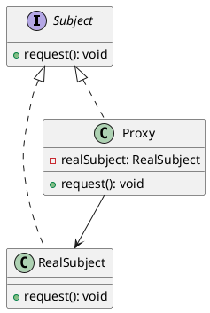
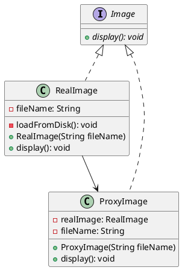

# 代理模式（Proxy Pattern）

- [代理模式（Proxy Pattern）](#代理模式proxy-pattern) - [代理模式實作](#代理模式實作)

---

## 簡單介紹

> 是一種結構型模式，它允許通過代理對其他對象進行間接訪問。代理模式通常用於限制對對象的訪問，或者在訪問對象之前進行其他處理，例如緩存、驗證、日誌記錄等。代理模式可以分為靜態代理和動態代理兩種。
> 代理模式（Proxy Pattern）是結構型模式之一，它提供了一個代理物件，控制著對其他對象的訪問。代理物件充當著客戶端和目標對象之間的中介，代理物件可以在不改變目標對象的情況下，對客戶端提供額外的功能。

## 架構

- UML



- Subject 是代理模式中的抽象主題，定義了代理和真實主題的共同接口，具體實現由 RealSubject 類來完成。
- Proxy 類是代理類，其內部維護了一個 RealSubject 對象的引用，代理類在其內部實現了對真實主題對象的操作，代理類也實現了 Subject 接口
- Subject（主題）：定義了 RealSubject 和 Proxy 對外公開的接口，也就是代理模式中的共同接口。
- RealSubject（真實主題）：代表了真正的主題，它實現了 Subject 定義的接口，是 Proxy 所代表的對象。
- Proxy（代理）：代表了真實主題的代理，它與 RealSubject 實現了相同的接口，並持有一個 RealSubject 的引用，這樣就可以代理 RealSubject 對外的行為。

  - UML 說明
    - Subject 是一個抽象類別，它定義了一個抽象的操作，也就是 doOperation()方法。
    - RealSubject 和 Proxy 分別繼承了 Subject，實現了 doOperation()方法。
    - Proxy 中還持有了一個 RealSubject 的引用，當代理的方法被調用時，它會委託 RealSubject 去執行真正的操作。
    - 使用繼承方式實現代理模式的好處
      - 可以共用 Subject 定義的介面和方法，同時也可以簡化代理的實現方式。
      - 這種方式也存在一些問題，比如當代理的行為和 RealSubject 的行為不同時，就不能使用繼承方式實現代理。
      - 使用繼承方式也會增加系統的複雜度，因此需要仔細考慮是否使用繼承方式實現代理模式。

## 模式：

- 遠程代理（Remote Proxy）：為一個位於不同的地址空間的對象提供一個本地的代理對象，使得客戶端可以透明地訪問該遠程對象。
- 虛擬代理（Virtual Proxy）：根據需要創建昂貴對象的代理。當一個對象的創建很耗時時，可以使用虛擬代理延遲對象的創建，直到客戶端需要真正的對象時才創建。
- 保護代理（Protection Proxy）：控制對原始對象的訪問，保護真實對象免於意外或有意的損壞。

## 應用場景

- 遠程代理：為了控制對遠程對象的訪問，通過代理對象在客戶端和服務端之間進行通信，以實現遠程訪問。
- 虛擬代理：當需要創建一個複雜對象時，可以先用代理對象代替這個對象，等到需要時再去創建實際對象，這樣可以提高性能和效率。
- 安全代理：用於控制對對象的訪問權限，例如只有特定的用戶才能訪問某個對象。
- 延遲加載代理：用於延遲加載一些耗時的資源，例如圖片、音頻等，只有在需要時才去加載這些資源，以提高性能和效率。

## 特性:

- 優點：
  - 代理模式可以使得代理物件控制對目標對象的訪問，可以在不改變目標對象的情況下，增加額外的功能。
  - 代理模式可以對目標對象進行保護，控制對目標對象的訪問，保護目標對象免於損壞。
  - 代理模式可以實現對目標對象的遠程訪問，使得客戶端可以透明地訪問位於不同地址空間的對象。
  - 代理模式可以實現對目標對象的延遲初始化，提高系統的性能。

- 缺點
  - 代理模式增加了系統的複雜度，需要創建多個類別才能實現代理模式。
  - 代理模式的設計需要考慮到目標對象和代理對象的關係，設計不當會導致系統過度複雜。
  - 代理模式可能會導致系統的性能降低，特別是當代理對象與目標對象之間的通訊開銷較大時。

## 實作

- 案例
  假設我們有一個圖像介面 Image，並有實現該介面的圖像類別 RealImage，該類別負責加載圖像並顯示它。我們還有一個代理圖像類別 ProxyImage，該類別也實現了 Image 介面，並且負責緩存圖像並根據需要加載它。



- 說明
  RealImage 和 ProxyImage 實現了 Image 介面。當需要顯示圖像時，我們先創建一個代理圖像物件 ProxyImage，並在第一次調用 display() 方法時，實例化一個 RealImage 物件來加載圖像，並調用 RealImage 的 display() 方法來顯示圖像。在下一次調用 display() 方法時，將直接使用已經加載的圖像，而不是再次創建一個新的 RealImage 物件。這種方式可以提高圖像顯示的效率，並節省內存空間。

```java
// Image interface
public interface Image {
    void display();
}

// Real Image class
public class RealImage implements Image {
    private String filename;

    public RealImage(String filename) {
        this.filename = filename;
        loadFromDisk();
    }

    @Override
    public void display() {
        System.out.println("Displaying " + filename);
    }

    private void loadFromDisk() {
        System.out.println("Loading " + filename);
    }
}

// Proxy Image class
public class ProxyImage implements Image {
    private RealImage realImage;
    private String filename;

    public ProxyImage(String filename) {
        this.filename = filename;
    }

    @Override
    public void display() {
        if (realImage == null) {
            realImage = new RealImage(filename);
        }
        realImage.display();
    }
}

// Usage
public class ProxyPatternExample {
    public static void main(String[] args) {
        Image image1 = new ProxyImage("image1.jpg");
        Image image2 = new ProxyImage("image2.jpg");
        // Image1 will be loaded from disk
        image1.display();
        // Image1 will not be loaded from disk, since it is cached in the proxy
        image1.display();
        // Image2 will be loaded from disk
        image2.display();
        // Image2 will not be loaded from disk, since it is cached in the proxy
        image2.display();
    }
}

```
